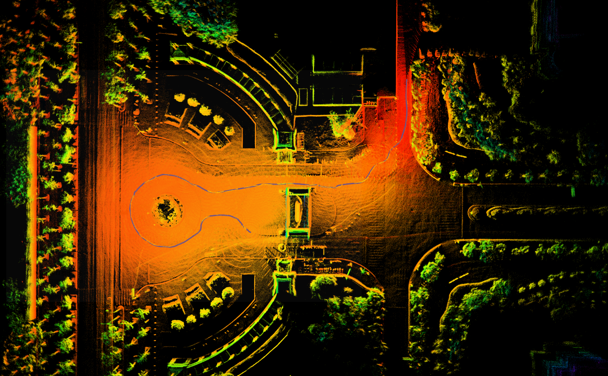
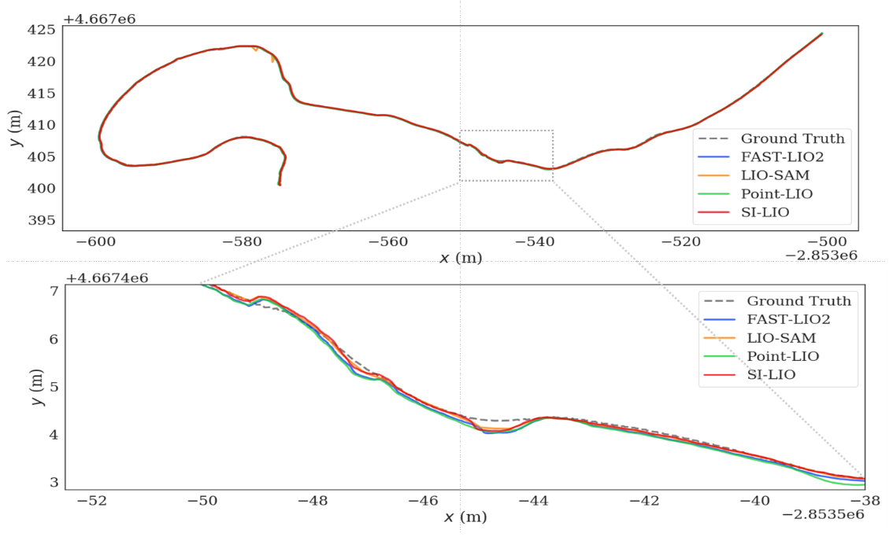

# SI_LIO
**SI_LIO** is based on the Invariant-EKF theory and our code is implemented on S-FAST_LIO.

This fork is based on the upstream SI-LIO repository and keeps the code focused on two estimator fixes:

- Fix missing `dt` factors in the state transition Jacobian `df_dx`.
- Preserve the LiDAR-IMU extrinsic states `offset_R_L_I` and `offset_T_L_I` during the EKF update.

No MLP, teacher-forcing, gate network, or training-data collection code is included in this repository.

<p align="center" style="display: flex; justify-content: center;">
    
    
</p>

Through theoretical analysis, it can be deduced that our IEKF-based estimation method achieves higher estimation accuracy compared to the Iterated EKF used in FAST-LIO2, particularly in scenarios with large IMU prediction errors. This experimental outcome corroborates our analytical conclusions.

## 1. Dependices
Sophus
Eigen
PCL
livox_ros_driver

## 2. Build
Clone the repository and catkin_make:

```
cd ~/catkin_ws/src
git clone https://github.com/USTC-AIS-Lab/SI-LIO.git
cd ../
catkin_make -j
source ~/catkin_ws/devel/setup.bash
```

## 3. Run
We recommend using the [M2DGR](https://github.com/SJTU-ViSYS/M2DGR) dataset.
```
roslaunch inva_fast_lio mapping_velodyne_m2dgr.launch
rosbag play street_04.bag
```

## 4. Changes in This Fork

### State transition `dt` fix

In `include/use-ikfom.hpp`, several Jacobian blocks in `df_dx` were missing the integration time step `dt`. These terms are now scaled by `dt` consistently with the discrete-time propagation model.

### Extrinsic-state preservation

In `include/esekfom.hpp`, the EKF `boxplus()` operation and post-update state assignment now preserve:

- `offset_R_L_I`
- `offset_T_L_I`

This prevents the LiDAR-IMU extrinsic states from being unintentionally reset or overwritten during filtering.

## 5. Acknowledgements
Thanks for the authors of [S-FAST-LIO](https://github.com/zlwang7/S-FAST_LIO.git) and [FAST-LIO](https://github.com/hku-mars/FAST_LIO).
